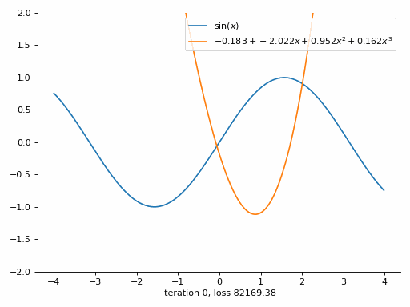
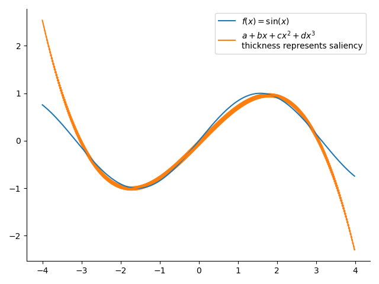

# Visualization of back propagation & saliency

## Back propagation
This [jupyter notebook](backpropagation_tutorial.ipynb) walk you through how back propagation works. 

## Saliency
This jupyter notebook shows saliency of the fitted function.

